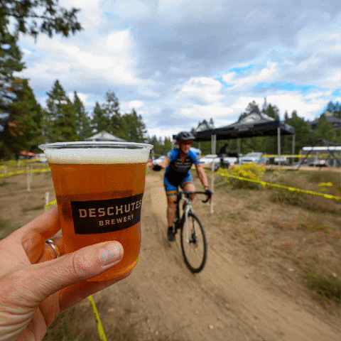

<h1 align="center">Bīk-n-Brü API</h1>
<div align="center"></div>

<br>
 
This repo is the Back End portion of the Bīk-n-Brü project built by Mod 3 students at [Turing School of Software and Design](https://turing.edu/). 

The purpose of this app is to encourage people to ride their bikes to bars to decrease their carbon footprint by gamifying the exercise/bar experience!

Visit our [Bīk-n-Brü Site](https://bik-n-bru.herokuapp.com/)! Or check out the Front End [Github Repo](https://github.com/Bik-n-Bru/FE-Bik-n-Bru-/).
<br>

# Table of Contents
- [Developer Setup](#setup)
- [Tech & Tools Used](#tech-and-tools)
- [Endpoints](#endpoints)
- [Contributors](#contributors)


## Tech and Tools
  -  **2.7.4**
  -  **5.2.8.1**
  -  **3.12.0**
  - 
  - 
  - 

## Developer Setup
  If you would like to demo this API on your local machine:
<ol>
  <li> Ensure you have Ruby 2.7.4 and Rails 5.2.8 installed </li>
  <li> Fork and clone down this repo and navigate to the root folder <code>cd BE-Bik-n-Bru</code></li>
  <li> Run <code>bundle install</code> </li>
  <li> Run <code>rails db:{drop,create,migrate,seed}</code> </li>
  <li> (Optional) To run the test suite, run <code>bundle exec rspec spec</code> </li>
  <li> Run <code>rails s</code> </li>
</ol>
You should now be able to hit the API endpoints using Postman or a similar tool.<br>
Default host is <code>http://localhost:3000</code>


  <!-- A user signs in using their [Strava](https://www.strava.com/) authentication. If they don't currently have a Strava Login there will be a link to take them to the Strava 
  website and create a login there.

  Upon logging in, the user will see
  The theoretical money that the user saves in gas costs by riding their bike is calculated when a bar trip is logged. That sum can then be used to 
  "purchase" drinks at the brewery they attended.
  The user will also be able to find breweries near their location, log their riding activy to a bar and earn badges for certain accomplishments (number of breweries
  visited, amount of CO2 they have offset by riding their bike vs driving and the chance to be on the app leader board based on miles ridden).  -->
 
## Endpoints

  - Production Base URL https://be-bik-n-bru.herokuapp.com

<details close>
<summary> Get User by Bīk-n-Brü id</summary><br>

  - GET "/api/v1/users/:id"<br>
  - Sample response body: <br>
    ```
      {
        "data": {
            "id": "2",
            "type": "user",
            "attributes": {
                "username": "testcase",
                "token": "12345abcde",
                "athlete_id": "12345",
                "city": "Not a city",
                "state": "Not a state"
              }
          }
      }
    ```
  
</details>

<details close>
<summary> Get User by Strava Athlete id</summary><br>

  - GET "/api/v1/users/:athlete_id?q=athlete_id"
  - Sample response body: 
    ```
      {
        "data": {
            "id": "2",
            "type": "user",
            "attributes": {
                "username": "testcase",
                "token": "12345abcde",
                "athlete_id": "12345",
                "city": "Not a city",
                "state": "Not a state"
              }
          }
      }
    ```
</details>

<details close>
<summary> Get Leaderboard Information</summary><br>

  - GET "/api/v1/leaderboard"
  - Sample response body: 
    ```
      {
        "data": [
          {
              "id": "",
              "type": "leader",
              "attributes": {
                  "username": "Muzgash",
                  "miles": 3039.5499999999997,
                  "beers": 363,
                  "co2_saved": 2735.6200000000003
              }
          },
          {
              "id": "",
              "type": "leader",
              "attributes": {
                  "username": "Eofor",
                  "miles": 3027.1300000000006,
                  "beers": 365,
                  "co2_saved": 2724.4199999999996
              }
          },
          {
              "id": "",
              "type": "leader",
              "attributes": {
                  "username": "Gléowine",
                  "miles": 3021.000000000001,
                  "beers": 360,
                  "co2_saved": 2718.93
              }
          },
          {...},
          {...},
        ...
        ]
      }
    ```
</details>


<details close>
<summary> Update a User's Information</summary><br>

  - PATCH "/api/v1/users/:user_id"<br>
  - Sample request body: <br>
    ```
       {
          "user": {
              "data": {
                          "city":"Eugene", 
                          "state":"Oregon"
                      }
          }
      }
    ```
  - Sample response body: <br>
    ```
      {
        :data=>{
            :id=>"5",
            :type=>"user",
            :attributes=>{
                :username=>"testcase",
                :token=>"12345abcde",
                :athlete_id=>"12345",
                :city=>"Eugene",
                :state=>"Oregon"
                }, 
                  :relationships=>
                    {:activities=>{
                      :data=>[]
                  }
              }
          }
      }
    ```
</details>

<details close>
<summary> Create A New User</summary><br>

  - POST "/api/v1/users"<br>
  - Sample request body: <br>
    ```
       {
          "user": {
              "data": {
                          "athlete_id":"12345678910112", 
                          "username":"testcase5", 
                          "token":"12345abcde"
                      }
          }
      }
    ```
  - Sample response body: <br>
    ```
      {
        :data=>{
            :id=>"5",
            :type=>"user",
            :attributes=>{
                :username=>"testcase5",
                :token=>"12345abcde",
                "athlete_id":"12345678910112",
                :city=>"Eugene",
                :state=>"Oregon"
                }, 
                  :relationships=>
                    {:activities=>{
                      :data=>[]
                  }
              }
          }
      }
    ```
</details>

<details close>
<summary> Get Breweries in a User's Local Area</summary><br>

  - GET "/api/v1/breweries/:user_id"
  - Sample response body:
    ```
      {
        "data": [
            {
                "id": "10-barrel-brewing-co-denver-denver",
                "type": "brewery",
                "attributes": {
                    "name": "10 Barrel Brewing Co - Denver",
                    "street_address": "2620 Walnut St",
                    "city": "Denver",
                    "state": "Colorado",
                    "zipcode": "80205-2231",
                    "phone": "7205738992",
                    "website_url": null
                }
            },
            {
                "id": "14er-brewing-company-denver",
                "type": "brewery",
                "attributes": {
                    "name": "14er Brewing Company",
                    "street_address": "2801 Walnut St",
                    "city": "Denver",
                    "state": "Colorado",
                    "zipcode": "80205-2235",
                    "phone": "7207731437",
                    "website_url": "http://www.14erBrewing.com"
                }
            },
            {
                "id": "aero-craft-brewing-denver",
                "type": "brewery",
                "attributes": {
                    "name": "Aero Craft Brewing",
                    "street_address": null,
                    "city": "Denver",
                    "state": "Colorado",
                    "zipcode": "80212-2199",
                    "phone": "3039185446",
                    "website_url": "http://www.aerocraft.beer"
                }
            },
            {...},
            {...},
          ...
        ]
      }
    ```
</details>

<details close>
<summary> Get Index of User Activities</summary><br>

  - GET "/api/v1/users/:user_id/activities"<br>
  - Sample response body: <br>
    ```
      {
        "data": [
            {
                "id": "701",
                "type": "activity",
                "attributes": {
                    "brewery_name": "Mirella Jenkins",
                    "distance": 92.64,
                    "calories": 2779,
                    "num_drinks": 11,
                    "drink_type": "Racer 5 India Pale Ale, Bear Republic Bre",
                    "dollars_saved": 14.74,
                    "lbs_carbon_saved": 83.38,
                    "created_at": "2023-01-10T13:18:37.335Z",
                    "user_id": 15
                },
                "relationships": {
                    "user": {
                        "data": {
                            "id": "15",
                            "type": "user"
                        }
                    }
                }
            },
            {
                "id": "702",
                "type": "activity",
                "attributes": {
                    "brewery_name": "Henry Adams",
                    "distance": 65.33,
                    "calories": 1959,
                    "num_drinks": 8,
                    "drink_type": "Stone IPA",
                    "dollars_saved": 10.39,
                    "lbs_carbon_saved": 58.8,
                    "created_at": "2023-01-10T13:18:37.354Z",
                    "user_id": 15
                },
                "relationships": {
                    "user": {
                        "data": {
                            "id": "15",
                            "type": "user"
                        }
                    }
                }
            },
            {...},
            {...},
          ...
        ]
      }
    ```
</details>

<details close>
<summary> Get Activity by Bīk-n-Brü Activity id</summary><br>

  - GET "/api/v1/acitivities/:activity_id"<br>
  - Sample response body: <br>
    ```
      {
          "data": {
              "id": "701",
              "type": "activity",
              "attributes": {
                  "brewery_name": "Mirella Jenkins",
                  "distance": 92.64,
                  "calories": 2779,
                  "num_drinks": 11,
                  "drink_type": "Racer 5 India Pale Ale, Bear Republic Bre",
                  "dollars_saved": 14.74,
                  "lbs_carbon_saved": 83.38,
                  "created_at": "2023-01-10T13:18:37.335Z",
                  "user_id": 15
              },
              "relationships": {
                  "user": {
                      "data": {
                          "id": "15",
                          "type": "user"
                      }
                  }
              }
          }
      }
    ```
  
</details>

<details close>
<summary> Create A New Activity</summary><br>

  - POST "/api/v1/activities"<br>
  - Sample request body: <br>
    ```
      {
          "activity": {
              "data": {
                          "brewery_name": "Name",
                          "drink_type": "IPA",
                          "user_id": "15"
                      }
          }
      }
    ```
  - Sample response body: <br>
    ```
      {
          "data": {
              "id": "701",
              "type": "activity",
              "attributes": {
                  "brewery_name": "Name",
                  "distance": 92.64,
                  "calories": 2779,
                  "num_drinks": 11,
                  "drink_type": "IPA",
                  "dollars_saved": 14.74,
                  "lbs_carbon_saved": 83.38,
                  "created_at": "2023-01-10T13:18:37.335Z",
                  "user_id": 15
              },
              "relationships": {
                  "user": {
                      "data": {
                          "id": "15",
                          "type": "user"
                      }
                  }
              }
          }
      }
    ```
</details>

<details close>
<summary> Get Index of User Badges</summary><br>

  - GET "/api/v1/users/:user_id/badges"<br>
  - Sample response body: <br>
    ```
      {
        "data": [
            {
                "id": "141",
                "type": "badge",
                "attributes": {
                    "title": "Completed 1 Activity"
                },
                "relationships": {
                    "user": {
                        "data": {
                            "id": "15",
                            "type": "user"
                        }
                    }
                }
            },
            {
                "id": "142",
                "type": "badge",
                "attributes": {
                    "title": "Cycled 100 miles"
                },
                "relationships": {
                    "user": {
                        "data": {
                            "id": "15",
                            "type": "user"
                        }
                    }
                }
            },
            {
                "id": "143",
                "type": "badge",
                "attributes": {
                    "title": "Cycled 500 miles"
                },
                "relationships": {
                    "user": {
                        "data": {
                            "id": "15",
                            "type": "user"
                        }
                    }
                }
            },
            {...},
            {...},
          ...
        ]
      }
    ```
  
</details>


# Contributors

### Project Team:
<table>
  <tr>
    <td></td>
    <td></td>
    <td></td>
    <td></td>
    <td></td>
  </tr>
  <tr>
    <td><strong>Amanda Ross</strong></td>
    <td><strong>Yuji Kosakowski</strong></td>
    <td><strong>Rich Kaht</strong></td>
    <td><strong>Gabe Nuñez</strong></td>
    <td><strong>Annie Pulzone</strong></td>
  </tr>
  <tr>
    <td>
      <div align="center"><a href="https://github.com/amikaross">GitHub</a><br>
      <a href="https://www.linkedin.com/in/amanda-ross-2a62093a/">LinkedIn</a></div>
    </td>
    <td>
      <div align="center"><a href="https://github.com/Yuji3000">GitHub</a><br>
      <a href="https://www.linkedin.com/in/yujikosa/">LinkedIn</a></div>
    </td>
    <td>
      <div align="center"><a href="https://github.com/Freeing3092">GitHub</a></div>
    </td>
    <td>
      <div align="center"><a href="https://github.com/MisterJackpots">GitHub</a><br>
      <a href="https://www.linkedin.com/in/gabriel-c-nunez/">LinkedIn</a></div>
    </td>
    <td>
      <div align="center"><a href="https://github.com/ajpulzone">GitHub </a><br>
      <a href="https://www.linkedin.com/in/annie-pulzone/">LinkedIn</a></div>
    </td>
  </tr>
</table>

### Project Manager:
<table>
  <tr>
    <td></td>
  </tr>
  <tr>
    <td><strong>Mike Dao</strong></td>
  </tr>
  <tr>
    <td>
      <div align="center"><a href="https://https://github.com/mikedao">GitHub</a><br>
      <a href="https://www.linkedin.com/in/michaeldao/">LinkedIn</a></div>
    </td>
  </tr>
</table>


